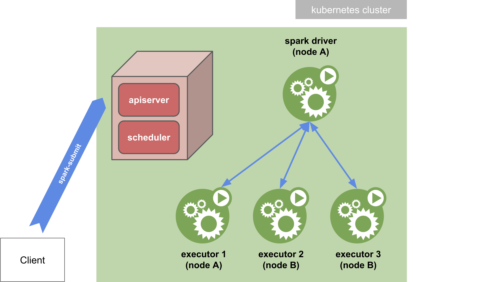
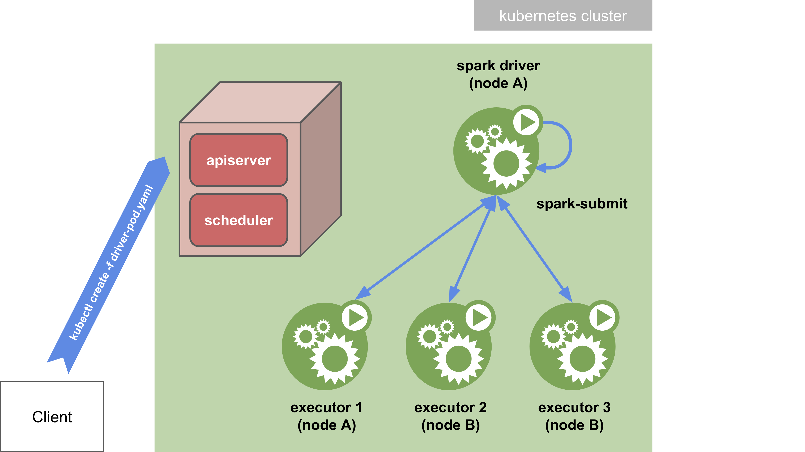

# Prerequisites

- A runnable distribution of Spark 3.0.0 or above.
- A service account used by the driver pods to create executor pods.

# Spark Docker image

Spark ships with a `bin/docker-image-tool.sh` script that can be used to build (and publish) the Docker image to use 
with the Kubernetes backend.

```bash
./bin/docker-image-tool.sh -t <tag> -p ./kubernetes/dockerfiles/spark/bindings/python/Dockerfile build
```

Push the image to the Container Registry of Google Cloud:

```bash
docker tag spark-py:3.0.1 eu.gcr.io/<project-id>/spark-py:<tag>
gcloud auth configure-docker
docker push eu.gcr.io/<project-id>/spark-py:<tag>
```

with `project-id=hippi-spark-k8s` and `tag` set to the version of Spark, here `3.0.1`.

# Running the Examples

## Spark-submit in cluster mode

In _cluster mode_, your application is submitted from a machine far from the worker machines (e.g. locally on your 
laptop). You need a Spark distribution installed on this machine to be able to actually run the `spark-submit` script. 
In this mode, the script exits normally as soon as the application has been submitted. The driver is then detached and 
can run on its own in the kubernetes cluster. You can print the logs of the driver pod with the `kubectl logs` command 
to see the output of the application.



It is possible to use the authenticating `kubectl` proxy to communicate to the Kubernetes API.

The local proxy can be started by:

```bash
kubectl proxy &
```
If the local proxy is running at localhost:8001, the remote Kubernetes cluster can be reached by `spark-submit` by 
specifying `--master k8s://http://127.0.0.1:8001` as an argument to `spark-submit`.

To launch Spark Pi in cluster mode with `spark-submit`, run the script [`spark-submit-py-pi.sh`](./spark-submit-py-pi.sh).

## Spark-submit in client mode

In _client mode_, the `spark-submit` command is directly passed with its arguments to the Spark container in the driver 
pod. With the `deploy-mode` option set to `client`, the driver is launched directly within the `spark-submit` process 
which acts as a client to the cluster. The driver pod must be created using the data in [spark-driver-pod.yaml](./k8s/spark-driver-pod.yaml). The input and output of the application are attached to the logs from the pod.



To launch Spark Pi in client mode, run the script [`run-client.sh`](./run-client.sh).

# Volcano

If specified in `spec.schedulerName` the pod will be dispatched by the specified scheduler. If not specified, the pod 
will be dispatched by the default scheduler.

**To be consistent, ensure that the same scheduler is used for driver and executor pods.**


